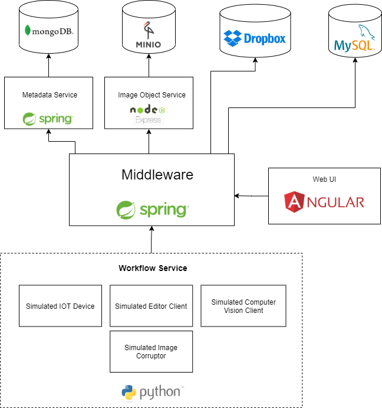

# Advanced Internet Computing WS 2020 - Group 3 Topic 3

## Team
- Dominik Fenzl, 01526544, 
- Ivan Lichner, 01226385
- Kevin Al-Chater, 01325538 
- Nils Moynac,  12016308
- Tiago Fragoso, 12005836 

## Overview
This application represents a federated storage system which makes use of two different data stores to store images with replication.
The replication is needed in case some of the images get corrupted, so the images can still be retrieved.
Additionally, the status of the image of an event is given, so the user can see which images are correctly stored or if something went wrong.
The user interface is a Webapplication which displays the events in the form of a table and in a map.
The map shows a radius for which the events are found, this can also be adjusted by the user.
Lastly, there is a details view which shows the details of an event and their respective tags and images.
The metadata of such an event can also be edited inside the UI.

## Architecture



## Components

### Middleware
Middleware service that keeps control of the replication, distribution and hashing services. Also it provides a gateway for the IoT devices as well as the user application.

The middleware also includes a rest endpoint to get the newest log messages of the middleware.

Lastly, the image file service is also embedded into this component, since it just calls the api that is already provided by Dropbox.

### Metadata Service
Takes care of all the metadata for a sensing event.
Sensing events can be stored, edited, updated and deleted.
For sensing events tags can also be stored, which have their own hashes so the different images can be compared.
Sensing events can be retrieved with the usage of pages.
Another way to retrieve events is to use coordinates and a radius to get all events in this radius.

### Image Object Service

This service exposes a **REST API** wrapping a **MinIO object server** responsible for storing image objects.

### Workflow Service

This service is charged of managing a basic workflow that shows the application potential. 

It gets data from the chosen repository, format them and order them chronologically. It sends sensing events to the middleware, changes metadata of sent sensing events, mocks a computing vision algorithm that adds tags to sensing events. It corrupt images to make their tag as "faulty".

### Webapplication
This is the front-end web application that the users will use to work with with sensing events sent from various IoT devices.

It is implemented in Angular and connected (only) to the middleware.
It has two main parts: 
- the overview table where the user can see all the sensing events stored in the storages and 
- the map, where the sensing events are shown at the place that they were captured

From both parts (table and map) the user can go to the detail view of an event. There he sees all the meta data and also the photo corresponding to this event with the tags images displayed in a carousel.
At the detail page the user can edit the meta data or delete the sensing event.

### Swagger
You can find the swagger ui under: http://127.0.0.1:9999/swagger-ui/index.html

## How to run

```bash
# Duplicate .env.example as .env and populate it
cp .env.example .env

# Run compose to launch all services
docker-compose up
```

## How to debug
Debugging can be done using the logs stored in the MySQL database.
The middleware provides an endpoint to request these logs and user
can access this endpoint trough the Swagger UI or make a direct GET
request to this endpoint at the address:
http://127.0.0.1:9999/logs and as request parameter the user can
specify how many logs he wants to get (by default he will get 20 logs).


## Effort Breakdown

|                      | DF  | IL | KA  | NM  | TF |
|----------------------|------|-----|-----|-----|----|
|Middleware            |      |  x  |     |     |    |
|Metadata Service      |  x   |     |     |     |    |
|Image Object Service  |      |     |     |     |  x |
|Image File Service    |      |     |  x  |     |    |
|Web Application       |      |     |  x  |     |  x |
|Workflow Script       |      |     |     |  x  |    |
|Integration Fixes     |  x   |  x  |     |     |  x |
|Presentation          |  x   |   x |  x  |  x  | x  |
|Architecture Planning |  x   |     |     |     |    |
|Manual Testing        |      |     |     |  x  |    |


